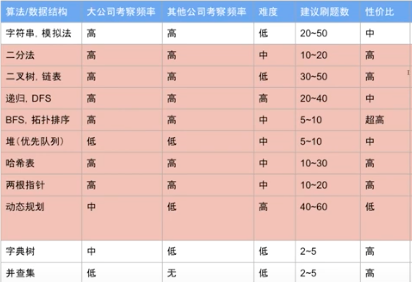
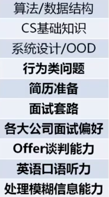
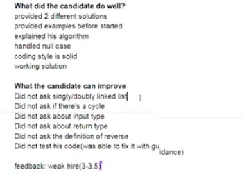

# 九章算法coding课/ 简历

## Introduction:

一个月攻克算法面试

```text
https://www.youtube.com/watch?v=XzPXnB5G2FA
```

## Content:

1. 代码风格（可读性、可修改、工程代码）：

* 不要把代码都写到一行上
* 不要在函数里面嵌套函数
* 函数名字可以写得长，可读性要高
* 不能有重复代码，函数化简化代码

2. 面试的时候要不要边写边说？如何跟面试官有效地沟通？

* 边写边说可能时间来不及
* 只写不说，如果前面错了也浪费时间
* **正确：先说我想这样，这样行不行，得到认可了之后就可以写了 （沟通、合作）**

3. 一些小细节：

* len\(string\) 复杂度是O\(1\) 
* 面试不一定要用最优的算法来解，面试官会让优化，follow up
* 代码质量：bug free, coding style, readable, no rebundunt, edging cases
* 考虑 null and empty
* 技巧：子函数 + 好的变量命名
* Hire：无需面试官提示，分别用主要的算法实现，代码质量优秀，无bug，无重复代码
* Implement Strstr: KMP 算法，Rabin-karp \(更简单\) hash function 一定要会！
* 经常考的：sorting, binary search, binary \(search\) tree, hash table, dynamic programming, divide and conquer, heap, greedy\(math\), trie, union find, minimum spanning tree



4. 面试遇到的问题：

* **一面试就大脑空白**、题目都做出来了还是被挂、知道思路但是不知道怎么表达（口语）、没有安全感，不知道应不应该再优化、**不知道应该问什么问题**、**不知道如何跟面试官交流**、behavior question
* 面试官要找一个可以愉快工作的合作伙伴
* offer谈判能力，聊个几个小时就能聊出几万，没有人跟钱过不去。
* **处理模糊信息的能力**：把模糊的需求转化成具体的工程解决方法。




5. mocking interview example



* 题目的定义是模糊的，一定要问清楚每一个细节，是什么type，input和output是什么？
* manually testing the code
* 如何用英文解释: 
* assumption: data type, input, output, definition of reverse \(example\) alright?
* string: null, empty, low/upper letter, special symbols? 
* Let's see how we are gonne approach this problem
* 讲清楚了，算是掌握了。（录音录下来）

6. Summary:

* Ask for questions, make an assumption: the definition of actions, data types of input and output, what are results when inputs are null and empty? 
* Give an example, show the first idea. Ask for opinions. 
* Make sure the algorithm is right, ask for starting to code
* Traverse the code by an example


